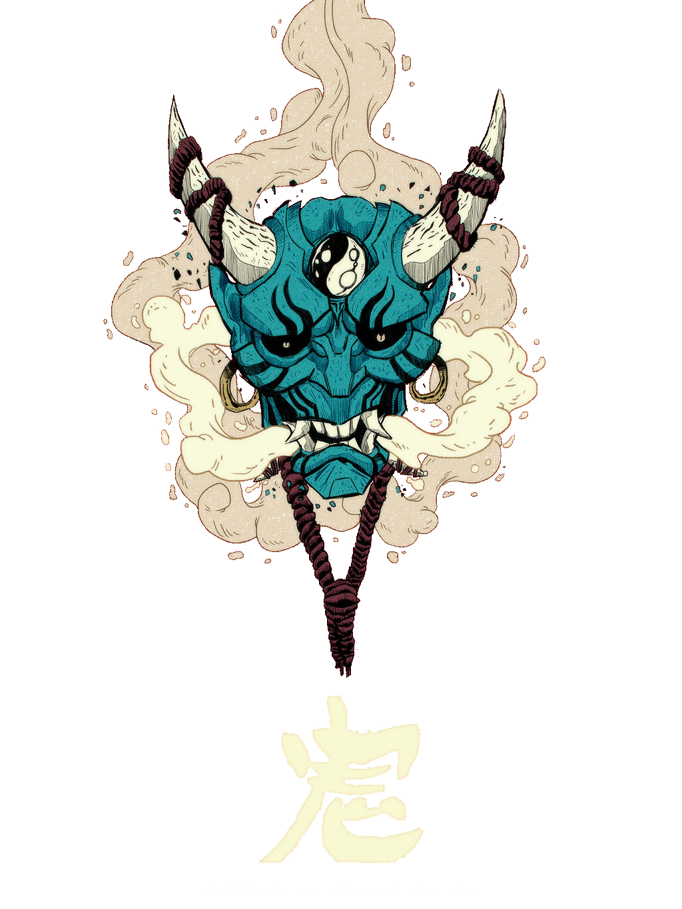

<h1 align="left" >
Hi there! ✌
</h1>

I'm Murilo Oliveira <i><b>(aka dot_)</b></i>, a Brazilian web development student.📚

<h2>💻 Techs:</h2>

  

  

 

<h2>💬 Find me here:</h2>

 

<h2>🎧 Listening now:</h2>

 

<h2>👥 Community:</h2>

 

